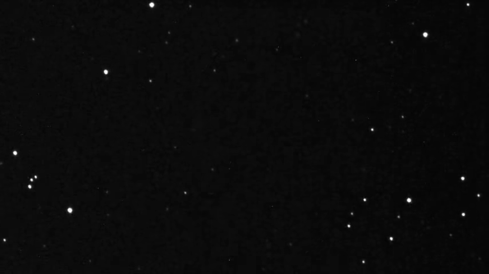

# Asteroid Detetctor
A very basic image processing college project for asteroid detection in crowd of stars.

Use MATLAB to run code and select two images of same area in space with probability of existance of any asteroid.

The output will the the asteroid only detected in crowd of stars.

Technology : MATLAB

We can see moving astroid in below images

